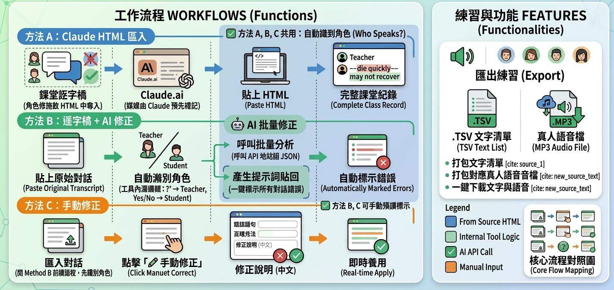

# 📝 ESL 課堂對話紀錄與修正

> 英文課逐字稿智慧整理工具 — 自動修正語句、產生練習清單、TTS 音檔練習

🔗 **線上使用：** https://winnieshih1107.github.io/enlearnassist/

---

## 流程圖總覽

三種建立課堂紀錄的方法（A／B／C）皆會先經過「自動識別角色」，再產生完整課堂紀錄；
右側則是建好紀錄後可使用的練習與匯出功能。



---

## 功能特色

| 功能 | 說明 |
|------|------|
| 📥 逐字稿匯入 | 貼上純文字逐字稿，自動識別 Teacher / Student 角色 |
| 🤖 AI 批量修正 | 一鍵分析所有學生句子，自動標示錯誤與正確用法 |
| 📋 Claude HTML 匯入 | 直接匯入 Claude.ai 回傳的修正 HTML，一次建立完整課堂紀錄 |
| ✎ 手動修正 | 對每句台詞手動標記錯誤語句、輸入正確說法與中文說明 |
| 🔊 TTS 練習 | 練習清單支援真人語音播放（Brian / Amy / Joey / Joanna） |
| ⚡ 語速調整 | 0.7x / 1.0x / 1.3x / 1.6x 四段語速 |
| ✅ 練習進度 | 打勾標記已完成，進度條即時更新 |
| 📤 匯出文字清單 | 一鍵匯出練習清單為 .TSV 格式（支援 Excel / Google Sheets 開啟） |
| 🎵 匯出語音檔 | 將練習清單句子打包成真人語音 .MP3/.WAV 音檔，一鍵下載 |
| 🈶 中文翻譯 | 練習句子可手動輸入中文，或用 Claude API 一鍵翻譯；匯入逐字稿時也會自動偵測「英文／中文」交錯格式並配對翻譯 |
| 🌐 中英雙語音檔 | 匯出音檔前可切換「英文」或「英文→中文→英文（加強記憶）」語音，每句先播英文、間隔後播中文，再重複播一次英文加深印象，下載雙語練習音檔 |
| ☑ 批次選取管理 | 練習清單與對話紀錄皆可勾選多筆，指定範圍匯出或一次批次刪除 |
| ⏸ 匯出可暫停 | 錄製匯出音檔時可暫停／繼續／停止，並即時顯示目前錄到第幾句 |
| ☁ Google Drive 雲端備份 | 用自己的 Google 帳號登入，把所有課堂紀錄與練習清單存成一個 JSON 檔到自己的 Drive；換裝置或清除瀏覽器資料後可登入讀回 |

---

## 使用流程

### 方法 A：Claude HTML 匯入（推薦）

這是最完整的工作流程，可以一次建好整份課堂紀錄含所有修正。

**Step 1 — 準備提示詞**

將以下提示詞連同課堂逐字稿一起貼到 [Claude.ai](https://claude.ai)：

```
請將以下 ESL 課堂對話整理成修正格式，學生：Winnie
使用以下 HTML class 輸出：
- .section-title：段落標題（如「詞彙學習 Vocabulary」）
- .exchange > .speaker-t：Teacher 標籤
- .exchange > .speaker-s：Student 標籤
- .line：每行對話內容
- .error（紅色劃掉）：學生說錯的部分
- .fix（綠色）：正確說法
- .note：中文說明（一句話）

逐字稿：
[貼上逐字稿]
```

**Step 2 — 複製 Claude 回傳的 HTML**

Claude 回傳修正格式 → 全選複製

**Step 3 — 匯入工具**

點工具頂部「**📥 Claude HTML 匯入**」→ 貼上 HTML → 點「解析並建立課堂」

→ 工具自動建立課堂、對話與所有修正，顯示如下格式：

```
Winnie
The patient has a serious disease, so ~~they will die quickly~~ they may not recover.
  │ 「die quickly」語感不精確，terminally ill 指終將致死，不一定是短期內。
```

---

### 方法 B：貼上逐字稿 + AI 批量修正

適合沒有 Claude.ai 帳號，或想在工具內直接分析的情境。

**Step 1 — 貼上逐字稿**

點頂部「**貼上逐字稿**」，輸入學生姓名（如 Winnie），貼上原始逐字稿。

**Step 2 — 指定角色**

- 若逐字稿有 `Teacher:` / `Winnie:` 標籤 → 自動解析
- 若無標籤 → 彈出角色指定視窗，系統自動偵測（問句 → Teacher，短回應 → Student），可手動調整

**Step 3 — AI 批量修正**

點對話區底部「**🤖 AI 批量修正**」：

| 條件 | 行為 |
|------|------|
| 已設定 Claude API Key | 直接呼叫 API，自動分析並套用所有修正 |
| 未設定 API Key | 自動產生提示詞，貼到 Claude.ai 取得 JSON 後貼回套用 |

> 設定 API Key：點 ⚙ 圖示 → 輸入 Anthropic API Key（儲存在本機，不上傳）

---

### 方法 C：手動修正

適合老師自行標記修正內容。

1. 匯入逐字稿後，滑鼠移到學生台詞 → 點「**✎ 手動修正**」
2. 填寫：
   - **錯誤語句**：原文中需劃掉的片語（如 `they will die quickly`）
   - **正確用法**：更自然的說法（如 `they may not recover`）
   - **修正說明**：中文解釋（選填）
3. 點「＋ 加入此修正」→ 即時顯示在對話記錄中

---

## 練習清單使用方式

| 操作 | 說明 |
|------|------|
| ＋ 加入練習 | 將句子（已套用修正的正確版）加入練習清單 |
| ▶ 播放 | TTS 朗讀該句子 |
| ↺3（手動修正視窗）| 重複播放 3 次強化記憶 |
| ▶ 全部播放 | 依序播放所有待練習句子 |
| ☑ 打勾 | 標記為已完成 |
| ☑ 多選加入練習 | 對話記錄上方按鈕，可勾選多句對話／詞彙，一次性加入練習清單 |
| 匯出清單 | 下載 .tsv 練習清單（可用 Excel / Google Sheets 開啟） |
| 🎵 匯出音檔 | 下載練習清單真人語音 .mp3/.wav 音檔（句間間隔 3 秒） |
| ☑ 選取（匯出用） | 練習清單每句前的勾選框，勾選後只匯出／處理選取的句子；不勾選則預設全部匯出 |
| 🗑 刪除選取 | 勾選練習清單中的句子後，按「刪除選取」一次批次移除 |
| 🌐 音檔語言 | 匯出前選擇「英文」或「英文→中文→英文（加強記憶）」；後者會每句先播英文、間隔後播中文翻譯，再重複播一次英文加強印象 |
| 🤖 Claude 一鍵翻譯 | 選擇「英文→中文→英文」匯出時，可用 Claude API 自動翻譯所有練習句，或在翻譯視窗手動輸入／修改 |
| 🔍 自動分離句中中文 | 若句子已把中文直接打在英文後面（如「Let me think. 我想想」），翻譯視窗未填翻譯欄位會導致匯出音檔只有英文；點此鍵一次偵測所有句子並自動拆到翻譯欄位 |
| ⏸ 暫停／停止（錄製中） | 錄製音檔過程中可暫停、繼續或直接停止，並即時顯示「第 X/Y 句」進度 |

---

## 自動角色偵測邏輯

匯入無標籤逐字稿時，系統依下列規則自動判斷：

| 條件 | 判定 |
|------|------|
| 句末有 `?` | Teacher |
| 問句的下一行 | Student |
| Yes / No / Okay / Sorry / I see 等短回應 | Student |
| `I'm teacher...` | Teacher |
| `I'm [學生名字]` | Student |
| 系統訊息（conference / internet / connection）| 略過 |

> 若逐字稿本身是「英文／中文」交錯格式（每兩行一組：英文原句＋中文翻譯），系統會自動偵測並將中文行當成對應英文句的翻譯，匯入後可直接用於「英文→中文→英文」雙語音檔匯出，不需再手動翻譯。

---

## 技術架構

- **開發語言：** 純 HTML / CSS / JavaScript（無框架依賴）
- **語音合成：** StreamElements TTS API（雲端）+ Web Speech API（備用）
- **語法分析：** LanguageTool 免費 API（🤖 自動修正功能）
- **AI 修正：** Anthropic Claude API（選用，需自備 API Key）
- **資料儲存：** localStorage（所有課堂紀錄存於本機瀏覽器）
- **雲端備份：** Google Identity Services（OAuth）+ Google Drive API v3（`drive.file` 範圍，僅能存取本工具自己建立的檔案）
- **HTML 解析：** DOMParser 解析 Claude HTML 輸出

---

## 資料說明

- 所有課堂紀錄預設儲存於**本機瀏覽器 localStorage**，換裝置不會自動同步
- 清除瀏覽器快取將**永久刪除**所有紀錄，建議定期點「匯出」備份，或使用下方「☁ Google Drive 雲端備份」
- Claude API Key、Google OAuth Client ID 僅儲存於本機，不會傳送至任何第三方伺服器

---

## ☁ Google Drive 雲端備份

把所有課堂紀錄與練習清單備份到你自己的 Google Drive，換電腦或清除瀏覽器資料後，登入 Google 帳號就能讀回。

### 首次設定（僅需一次）

1. 點頂部「**☁ 雲端備份**」→「**📖 設定教學**」，依步驟到 [Google Cloud Console](https://console.cloud.google.com/) 建立一個 OAuth 用戶端 ID（應用程式類型選「網頁應用程式」，並把本工具網址加入「已授權的 JavaScript 來源」）
2. 複製建立好的 Client ID（結尾是 `.apps.googleusercontent.com`）
3. 到「**⚙ 設定**」貼上並儲存

### 日常使用

| 操作 | 說明 |
|------|------|
| 🔑 登入 Google | 授權本工具存取 Drive（只能讀寫它自己建立的檔案，看不到你 Drive 裡其他檔案） |
| ⬆ 存到雲端 | 把目前所有課堂紀錄、練習清單打包成 `esl-transcript-backup.json`，存到你的 Drive |
| ⬇ 從雲端讀取 | 下載雲端備份並**覆蓋**本機目前資料（讀取前會再次確認，避免誤觸） |
| 登出 | 結束這次瀏覽器的登入狀態 |

> 因應用程式未經 Google 正式審核（測試模式），每 7 天需要重新登入一次，屬正常現象，不影響已存的雲端資料。

---

## 授權

MIT License — 自由使用與修改
